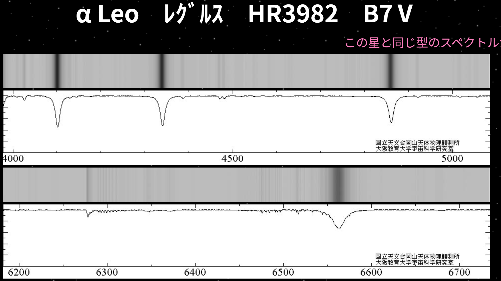
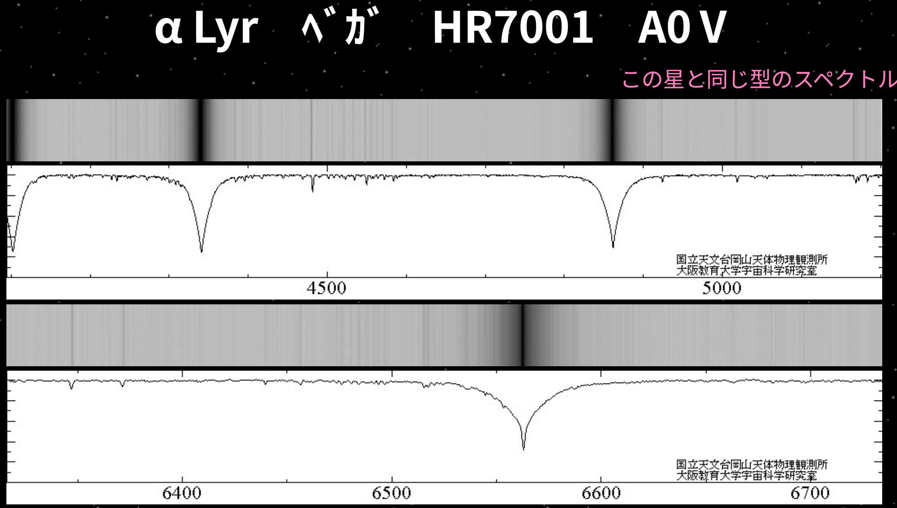
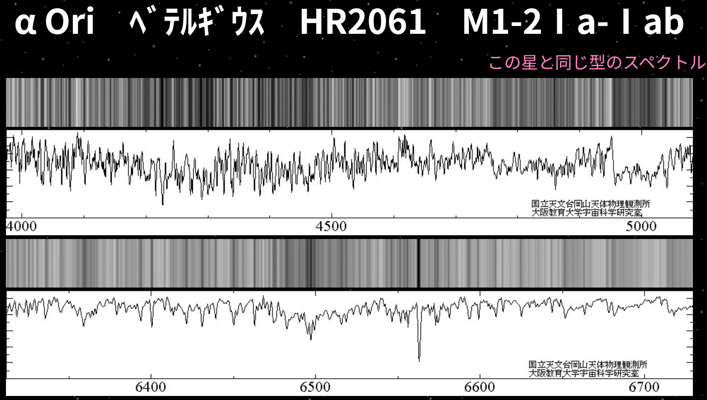

天体を望遠鏡でのぞき、その光をプリズムなどで分光すると波長ごとに分けられた光(**スペクトル**)が得られる。
このスペクトルには連続スペクトルと線スペクトルが存在する。

実際に星から得られるスペクトルは画像のような感じ。

これが分類

## 関連リンク

- 岡山天体物理観測所で観測された恒星のスペクトルが[こちら](http://www.oao.nao.ac.jp/stockroom/extra_content/story/top/top.htm)で見れる。
