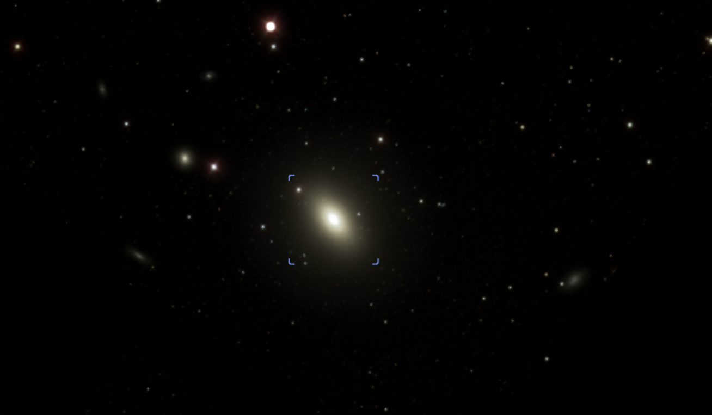
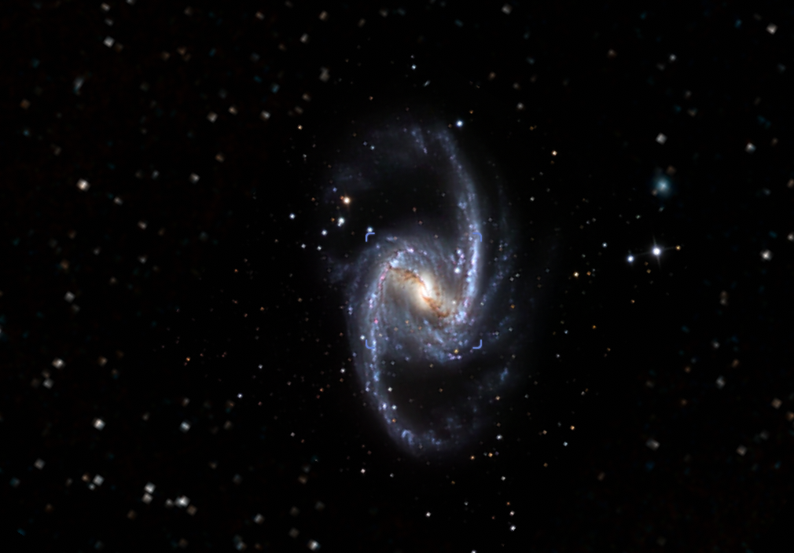
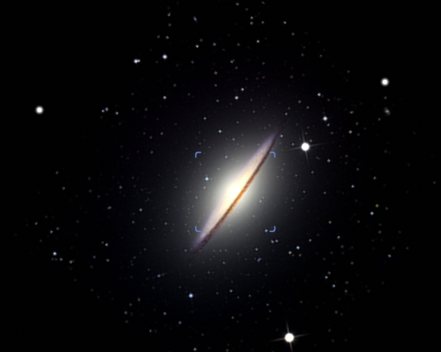
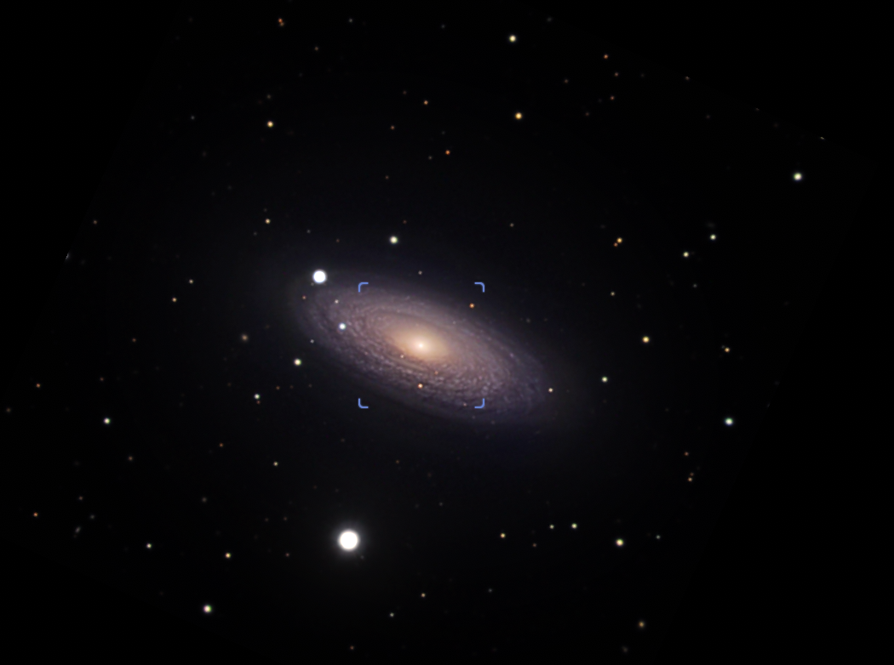
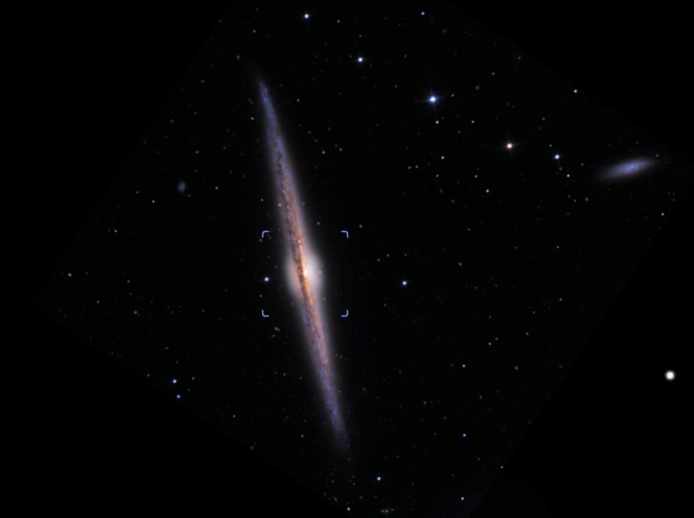
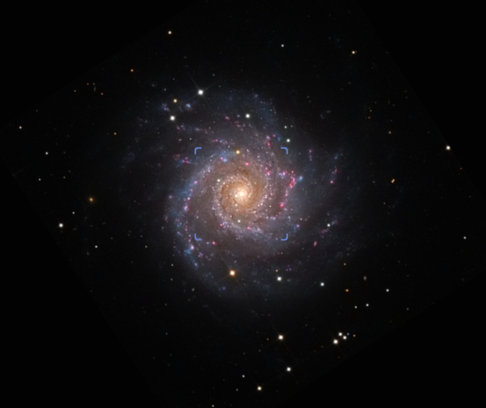
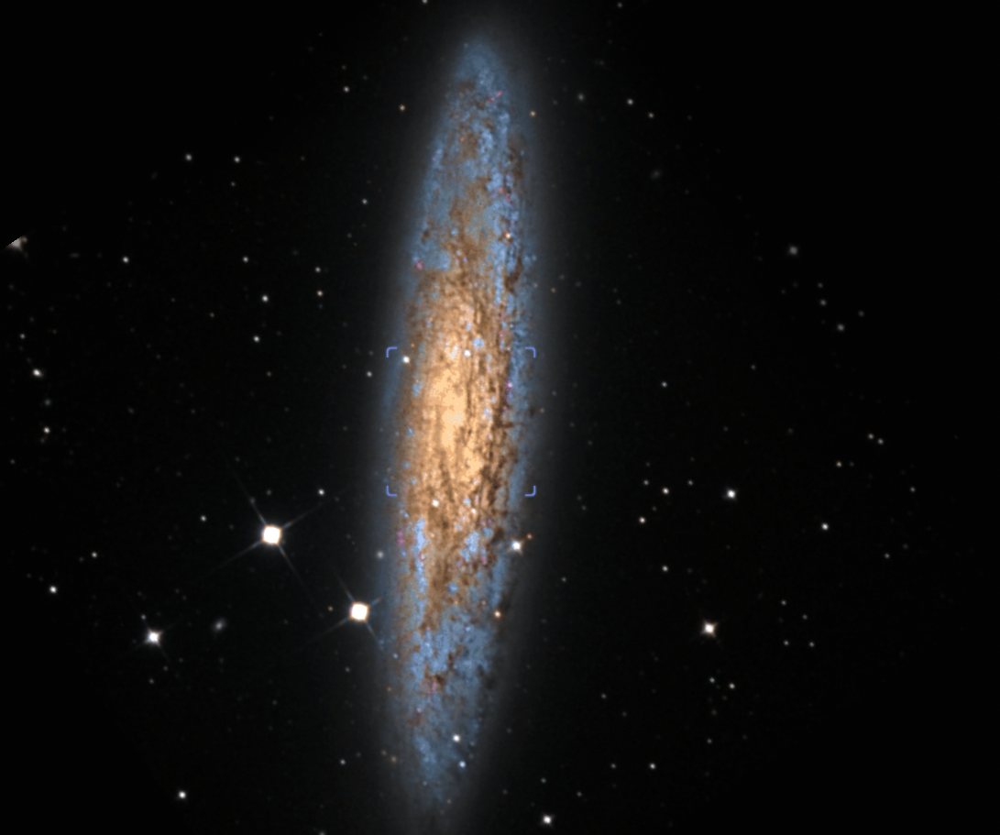
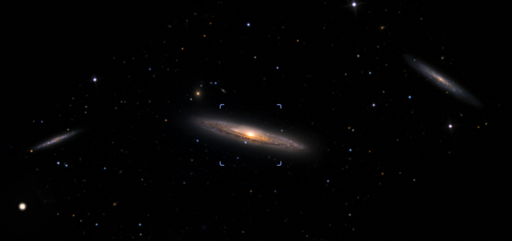
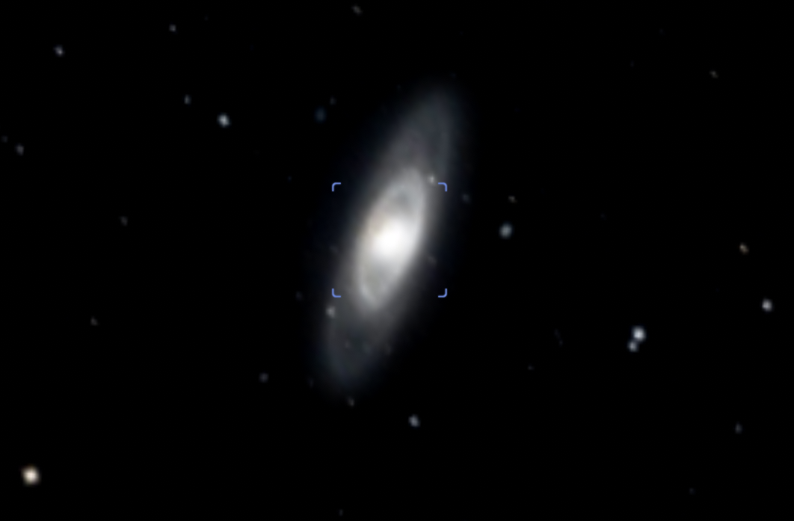
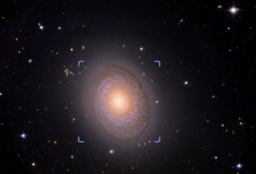

## ハッブル分類

銀河を分類するときハッブルによる分類法がかつてから現在まで使われている。
その分類方法についてみていく

**銀河の見かけの形状**

* 楕円銀河(E型: Elliptical Galaxy)
* 渦巻銀河(S型: Spiral Galaxy)
* 棒渦巻銀河(SB型: Barred Spiral Galaxy)
* 不規則銀河(Irr型: Irregular Galaxy)
* レンズ状銀河(S0: Lenticular Galaxy)

### 楕円銀河(E型)

見かけの楕円率で細かく分類され、${\rm E}n$とあらわされる。$n$は$0\sim7$の数字で、楕円銀河の長軸$a$、短軸$b$について

$$
n = 10\times \frac{a-b}{b}
$$

で表される。$a=b$の時、円形となり、$E0$となる。

### 渦巻銀河(S型)

構造として、以下を持つ

* バルジ
* ディスク(銀河円盤)
* 渦状腕

腕の巻き付き度合いからSa, Sb, Scと細かく分類される。

### 棒渦巻銀河(SB型)

構造としてS型に似ているが、バルジではなく**バー**を持つ。

腕の巻き付き度合いからSBa, SBb, SBcと細かく分類される。

### S0型

楕円銀河と渦巻銀河の中間的な銀河

### Irr型

上記に当てはまらないもの

## 銀河を構成する星

- 楕円銀河や渦巻/棒渦巻銀河の中心部(バルジ/バー)を構成する星は、赤色巨星や暗い主系列星である。これを種族II(Population II)という。
- 銀河円盤は青く明るい若い星を多く含む。これらの星を種族I(Population I)という。

## いろいろな銀河

