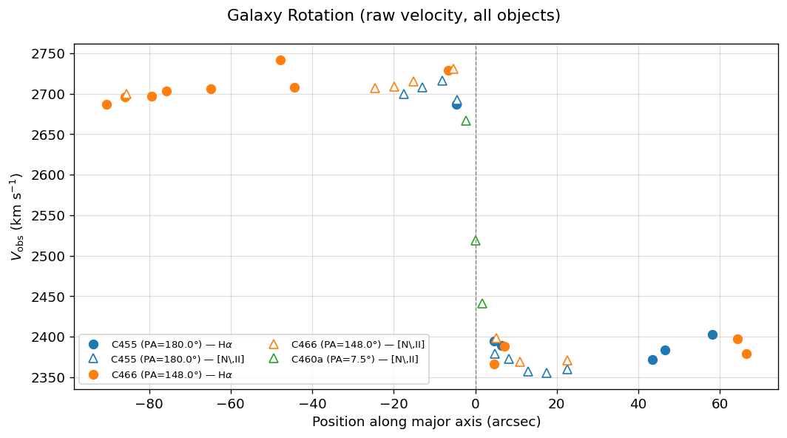

## 銀河の傾き角

銀河の回転速度を求めるためには銀河の傾き角$i$が必要となる。
銀河は円形だが、見る方向によって楕円となる。
銀河の回転軸と視線とのなす角を**銀河の傾き角**とよぶ。
銀河の傾き角$i$は、楕円の長半径$a$, 短半径$b$に対して、

$$
\cos{i} = \frac{b}{a}
$$

から得られる。

## 銀河の回転曲線

銀河のある点の視線速度は、その点の光や電波のスペクトル線のドップラー変位を観測することで求めることができる。実際に銀河円盤の長軸上の点について、視線速度をプロットした研究がRubinらによって1978年にされている([参照](https://adsabs.harvard.edu/pdf/1978ApJ...224..782R))

実際に論文のデータで銀河の「長軸」に対する「回転速度」を見てみると次の図のようになる。ここではNGC4278を対象に複数のスペクトログラムで撮影されている(C455やC466など)。

また、銀河の回転速度$V(r)$を求めてみよう。
銀河の傾き$i$、銀河全体(中心)の視線速度$v_0$とすると、$V(r)$は

$$
V(r) = \frac{|v(r) - v_0|}{\sin{i}}
$$

で与えられる。銀河曲線をそれぞれプロットすると次の図のようになる。

## 銀河の回転速度と質量分布

銀河の回転速度から質量を求められる。
なぜなら、銀河の回転と銀河の重力が釣り合って、形状が保たれているからである。

銀河中心から距離$r$の位置にある質量$m$の恒星が速度$V$で回転しているとき、遠心力は$f$は

$$
F_{\rm rotate} = \frac{mV^2}{r}
$$

で与えられる。恒星に働く重力$F$は銀河中心から半径$r$の級内に含まれる全質量$M(r)$を用いて

$$
F_g = -\frac{GmM(r)}{r^2}
$$

で与えられる。これらの和が0になることから

$$
\begin{align*}
\frac{mV^2}{r}-\frac{GmM(r)}{r^2}  &= 0\\
\therefore M(r) &= \frac{V^2}{G}r
\end{align*}
$$

を得る。

## TODO ダークマターの質量を求める
