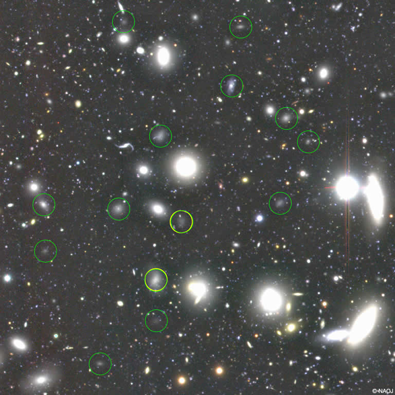

宇宙には銀河が密の場所と疎な場所がある。
銀河が密集している領域を**銀河団**、存在しない空間を**ボイド**という。

こういった宇宙の大規模構造の3次元地図を作ることを目的としている**スローン・デジタル・スカイサーベイ**(SDSS. [ウェブページ](https://www.sdss.org/))というプロジェクトがある。(TODO: このプロジェクトでのデータ分析を行う)

我々が所属している**銀河群**を**局部銀河群**と呼ぶ。

## ビリアル定理

銀河団がバラバラにならず、かつすべての銀河が中心に落ちないための条件を表すのが**ビリアル定理**である。

銀河団の全質量を$M$, 半径を$R$, 構成する銀河のランダム運動の二乗平均を$\langle V^2 \rangle$とする。
銀河をお互いに結びつける全位置エネルギーは

$$
\Omega \sim - \frac{GM^2}{R}
$$

であり、一方銀河が集団から脱出しようとする全運動エネルギーは

$$
T \sim \frac{1}{2} M \langle V^2 \rangle
$$

である。この時銀河団が長い期間にわたって、大きさなどの巨視的な状況を変えないための条件は

$$
2T + \Omega = 0
$$

であることが経験的に知られている。
これらをの条件から

$$
\begin{align}
2 \times \frac{1}{2} M \langle V^2 \rangle - \frac{GM^2}{R} &= 0 \\
\therefore M &\sim \frac{R\langle V^2 \rangle}{G}
\end{align}
$$

という関係が得られる。銀河団の半径$R$と銀河のランダム運動についてわかれば、銀河団の総質量がわかることになる。

## かみのけ座銀河団

かみのけ座銀河団の画像([NAOJ](https://www.nao.ac.jp/news/science/2015/20150623-subaru.html)より)

**特徴**

- 見かけの等級$\mathfrak{m_v}$が18.3等より明るい銀河は1525個ある。
- 暗い銀河のほうが数が多くなる傾向
- $\mathfrak{m_v}=14.5$より明るい銀河の明るさを総計した全等級は$\mathfrak{m_v} = 8.0$。それ以外も総計に加えると$\mathfrak{m_v} = 7.2$となる。14.5等より明るい銀河は184個であり、全体の明るさの約半分を占める。
- 系統的な赤方偏移は$z=0.0232, V_r = 6888 {\rm km/s}$, ランダム運動は$\sqrt{\langle V^2\rangle} = 86{\rm km/s}$
- 視野角$6^\circ$程度

**距離**

距離$d$は、ハッブル・ルメートルの法則$z = \frac{H}{c}r$より

$$
\begin{align}
d &= \frac{zc}{H} \\
&= \frac{0.0232 \times 2.99792 \times 10^{5}{\rm km / s}}{72{\rm km /s /Mpc}}\\
&=96.6 {\rm Mpc}
\sim 3億1500万光年
\end{align}
$$

と見積もられる。

**半径**

視野角を$6^\circ$とすると、半径は

$$
\begin{align}
R &= d\tan{\theta}\\
&=96.6{\rm Mpc} \times \tan(6^\circ/2)
&= 5.06 \rm Mpc
\end{align}
$$

を得る。

**質量**

質量はビリアル定理より、

$$
\begin{align}
M &\sim \frac{R \times 3\langle V_r^2 \rangle}{G}\\
&=\frac{5.06{\rm Mpc} \times 3\times (86{\rm km/s})^2}{6.67 \times 10^{-11} {\rm N m^2 kg^{-2}}}\\
&=\frac{(5.06 \times 3.086 \times 10^{22} {\rm m}) \times 3\times(7.386 \times 10^{9}{}\rm m^2 s^{-2})}{6.67 \times 10^{-11}{\rm m^3 s^{-2} kg^{-1}}}\\
&= 5.193 \times 10^{43}{\rm kg} = 2.6 \times 10^{13} M_\odot
\end{align}
$$

が得られる。

**全光度**

天体の距離$d$、見かけの等級$m$、絶対等級$M$には

$$
\mathfrak{m_v} - \mathfrak{M} = 5\log{d} - 5
$$

という関係が成り立つことから、絶対等級は

$$
\begin{align}
\mathfrak{M} &= \mathfrak{m_v} - 5\log{d} + 5\\
&= 7.2 - 5\log(96.6 {\rm Mpc}) + 5\\
&= 7.2 - 5\times 7.985 + 5\\
&= -27.725
\end{align}
$$

となる。絶対等級と光度の関係は

$$
\frac{L}{L_\odot} = 10^{\frac{\mathfrak{M_\odot} - \mathfrak{M}}{2.5}}
$$

で表されるため、全光度は($\mathfrak{M_\odot} = 4.83$として)

$$
\frac{L}{L_\odot} \sim 10^{\frac{4.83 - (-27.725)}{2.5}} =10^{13.022} = 1.05 \times 10^{13}
$$

を得る。

**質量光度比**

質量光度比$(M/M_\odot)/(L/L_\odot)$は

$$
\frac{(M/M_\odot)}{(L/L_\odot) }=\frac{2.6 \times 10^{13}}{1.05 \times 10^{14}}  = 2.48
$$

TODO: ダークマターの量の推定

## X線で見た銀河団

TODO

