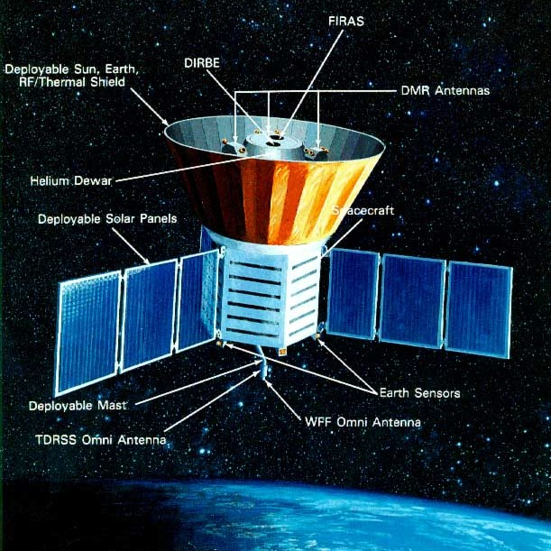
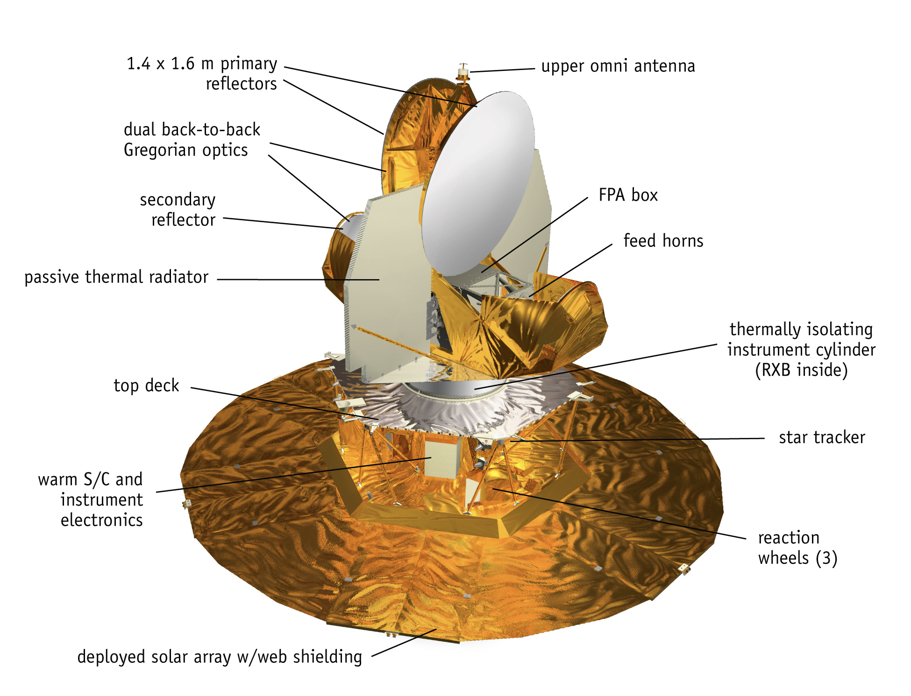
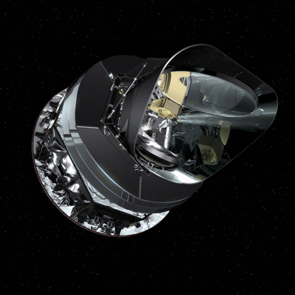
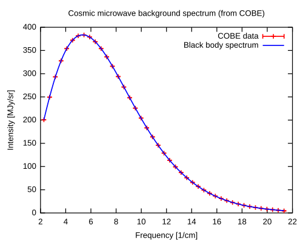

## 歴史

1964年、アメリカ合衆国のベル電話研究所で、アーノ・ペンジアスとロバート・ウィルソンはアンテナの雑音を減らす研究をしている時、ある信号を発見した。
それがかねてから考えられていた**宇宙マイクロ波背景輻射**(宇宙背景放射/マイクロ波背景輻射, Cosmic Microwave Background; **CMB**)であった。
絶対温度が約$3K$($2.728K$)であることから3K背景放射などともいう。

このCMBは**ビッグバン理論の証拠**として、かねてからジョージ・ガモフやラルフ・アルファー, ロバート・ハフマンにより1940年代から予言されていた。
なぜビッグバン理論の証拠として考えられているかは次節で述べる。

この発見により、ペンジアスとウィルソンは1978年にノーベル物理学賞を受賞した。

## 宇宙の進化

ビッグバン宇宙理論によると、約138億年前、宇宙は熱い火の玉(ビッグバン)として誕生し、膨張が始まった。
高エネルギーの素粒子のプラズマ状態だった宇宙は、1秒ほどで素粒子どうしで対消滅しあい、
3分ほどすると電子や陽子、ニュートリノや光子のみが残った。
38万年まではまだプラズマ状態が保たれており、自由電子が邪魔することで光が直進できず不透明だった。
その後3000-4000Kまで温度が冷えると、水素原子核として養子と電子が束縛されることで光が進めるようになった(**宇宙の晴れ上がり**)。
この時の光子のスペクトルが背景放射として存在している。
  
## 観測実験

これまで3機の衛星によりCMBが観測されている。

**COBE**

１つ目はCOBE衛星である。
1989-1996年にかけてCOBE(コービー)衛星によって観測が行われた。Explorer 66という名前でも親しまれている。

**WMAP**

2つ目はWMAP衛星である。
2001年6月に打ち上げられた。

**プランク衛星**

3つ目はプランク衛星である。

## 観測結果

上図はCOBE衛星による宇宙背景放射のスペクトルであり、黒体輻射のスペクトルとなっている。

## TODO

その他の観測結果とその分析を行う。