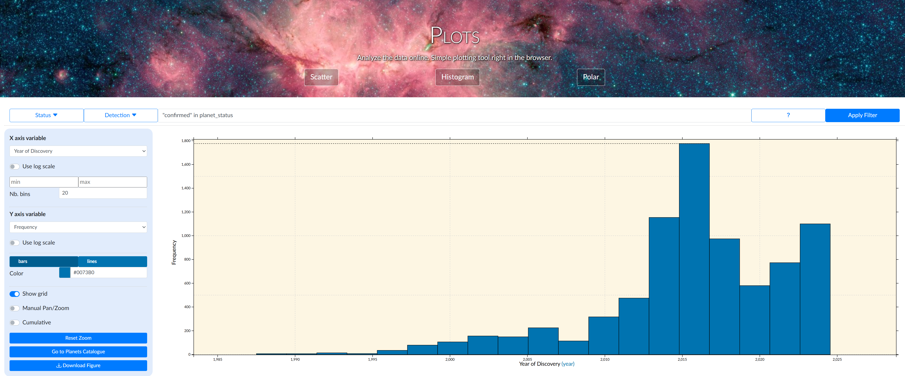
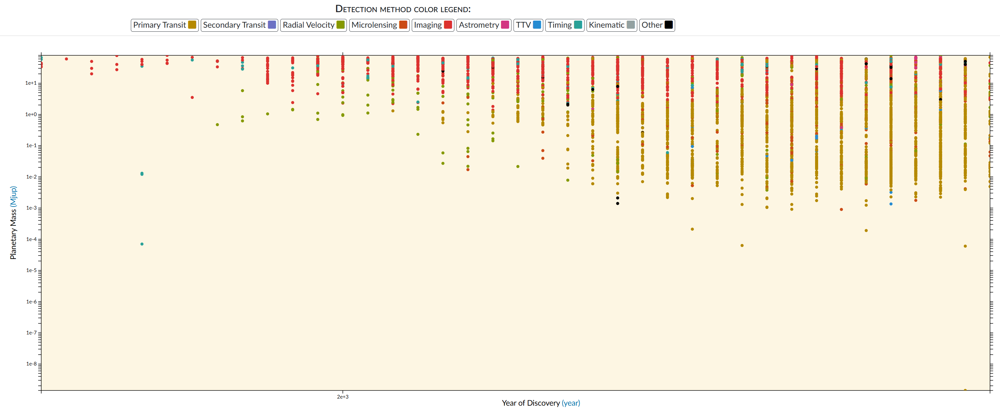

## 歴史

- 1940年代から系外惑星の探査が行われた。
- 1980年代で観測技術が発展し、本格的になった。
- 1990年代前半「系外惑星はない」と結論付けたチームがいた。
- 1995年主計列星の周りに系外惑星を発見。
  - ジュネーブ天文台ミシェル・マイヨール、ディディエ・ケローらがペガスス座51番星の周囲に巨大惑星が好転していることを発見。ノーベル賞受賞。([参考](https://www.nobelprize.org/prizes/physics/2019/press-release/))

## すでに見つかっている系外惑星

[このページ](https://exoplanet.eu/home/)や[このページ](http://exoplanets.org/)で、すでに見つかっている系外惑星が見られるらしい。

実際に発見された年でヒストグラムを描画すると次のようになった。

上記の歴史より前に発見されてる!?1987年に7件も発見されてたみたい...?実際データ見たら見つかってた、みたいなことがあったのかな?

発見された年と発見された系外惑星質量のグラフ。

最近になるほど軽い惑星も見つかってるみたい。観測技術が上がってそう。

## 系外惑星の探査方法

いくつか系外惑星の探査方法がある。

- 天体位置探査法: 天体位置探査法は主星の位置を測定してふらつきを判定する方法。
- 視線速度法(ドップラー法): 主星のふらつきによるスペクトルのドップラー効果を検出する方法
- トランジット法: 惑星の蝕による主星の明るさの変化を検出する方法
- 重力マイクロレンズ法: 主星の重力レンズによる増光高度曲線の不規則性から検出する方法
- 直接撮像法: 大型望遠鏡や光干渉計などで惑星像を直接検出する方法

などなど。

## TODO

実際にドップラー法とトランジット法で諸量を求めてみる。