## 問1

## 問2

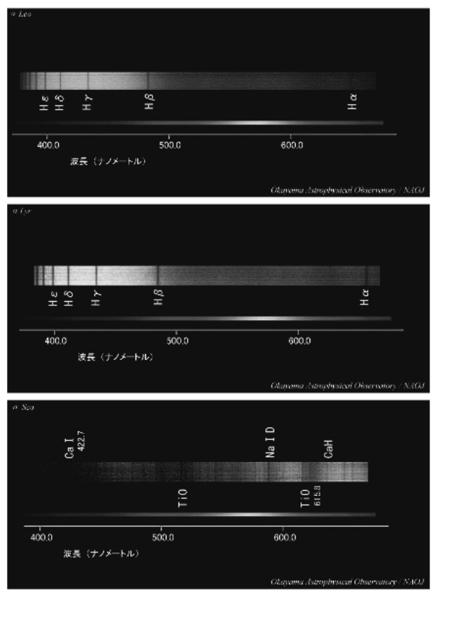

## 問3

## 問4

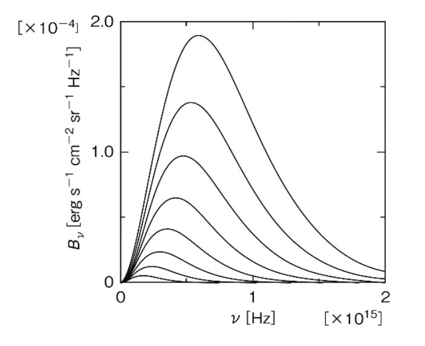

## 問5

## 問6

## 問7

## 問8

## 問9

## 問10

## 問11

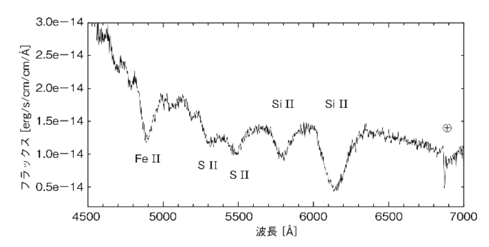

## 問12

## 問13

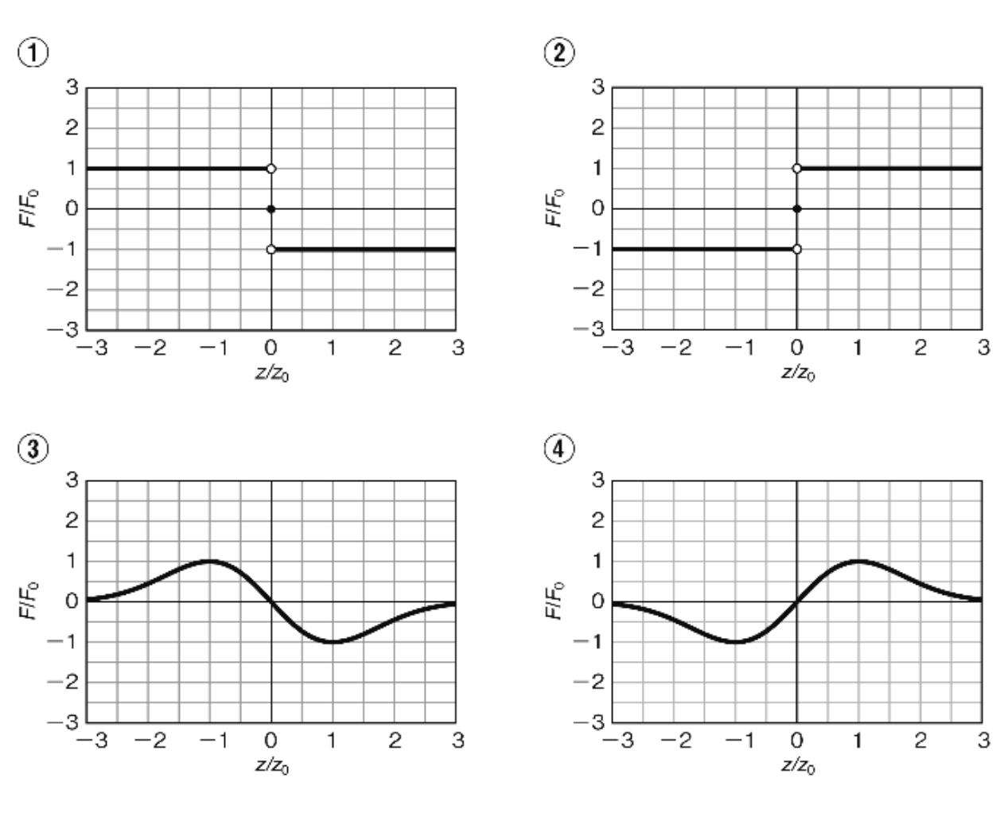

## 問14

## 問15

## 問16

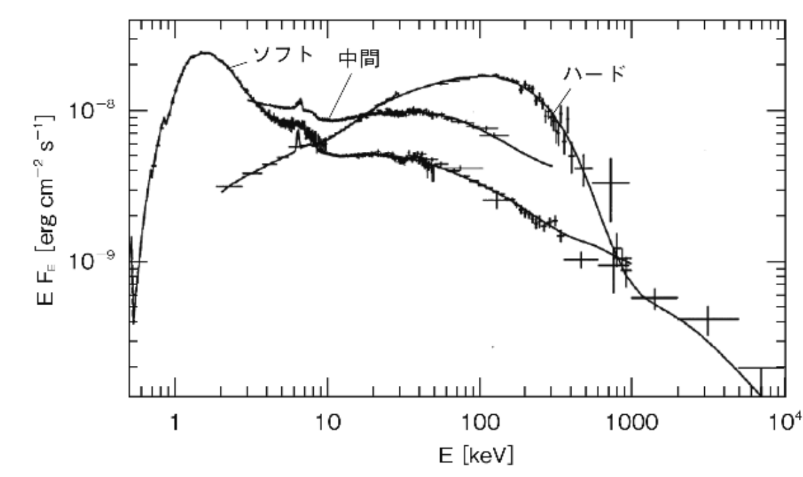

## 問17

## 問18

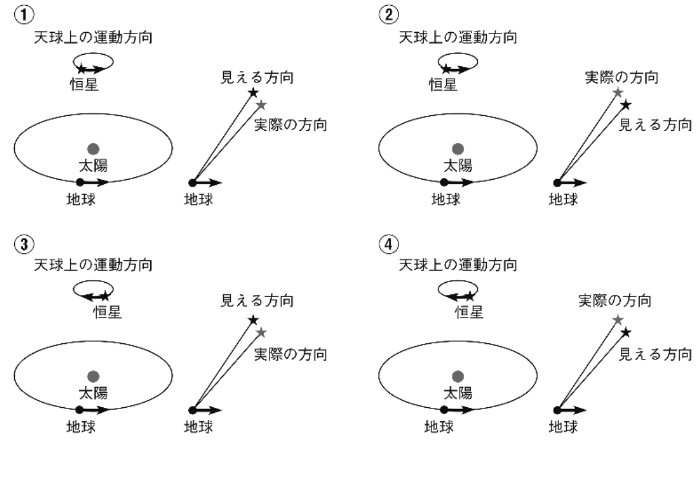

## 問19

## 問20

## 問21

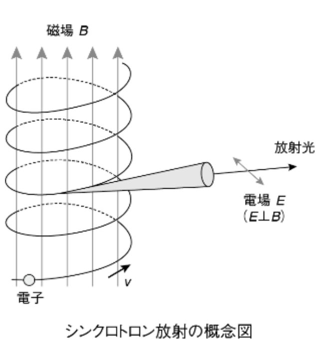

## 問22

## 問23

## 問24

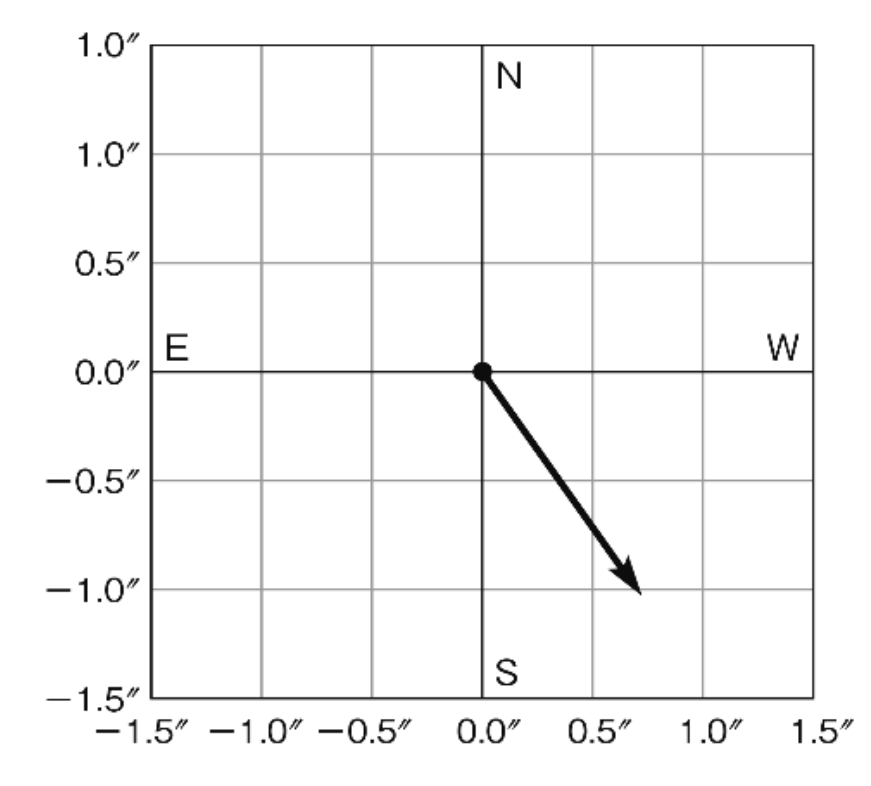

## 問25

## 問26

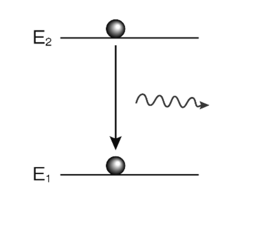

## 問27

## 問28

## 問29

## 問30
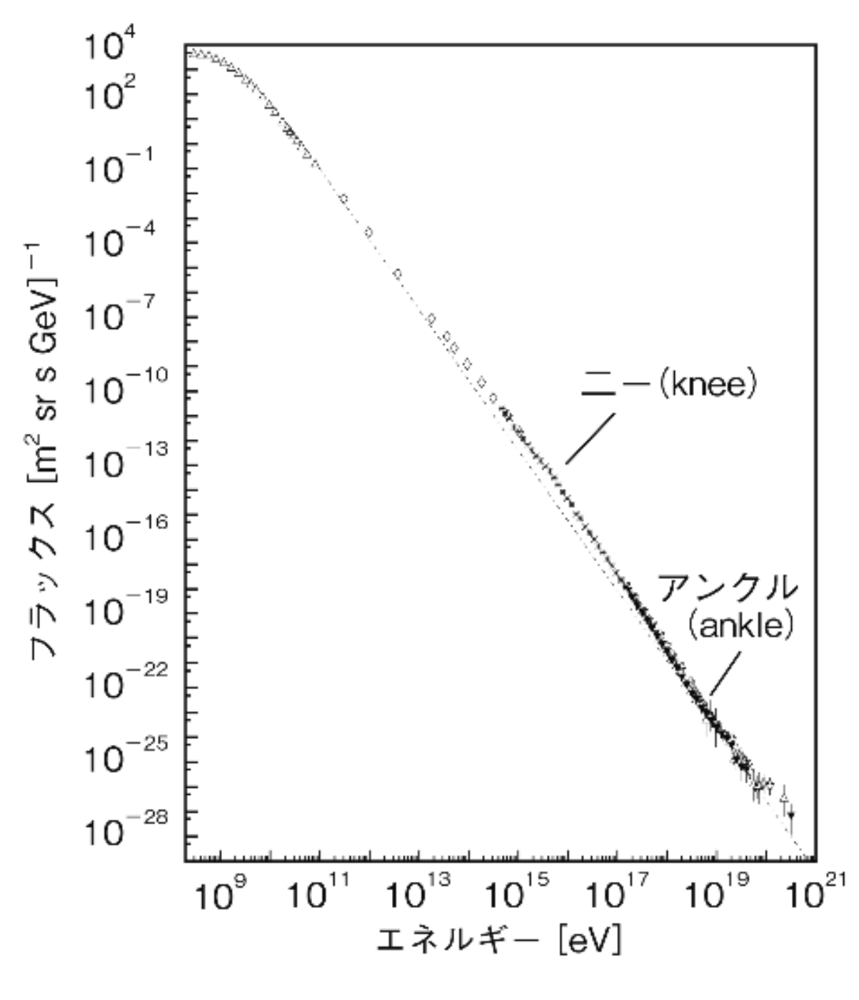

## 問31

## 問32

## 問33

## 問34

## 問35

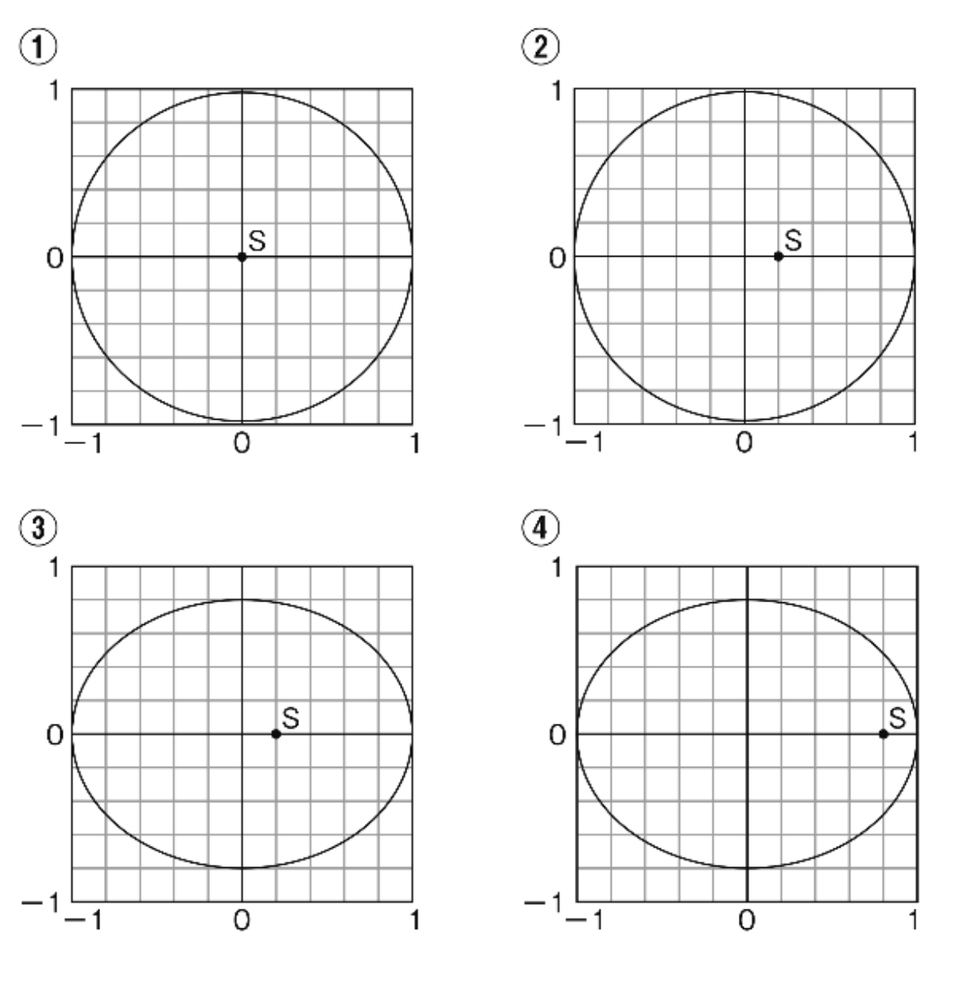

## 問36

## 問37

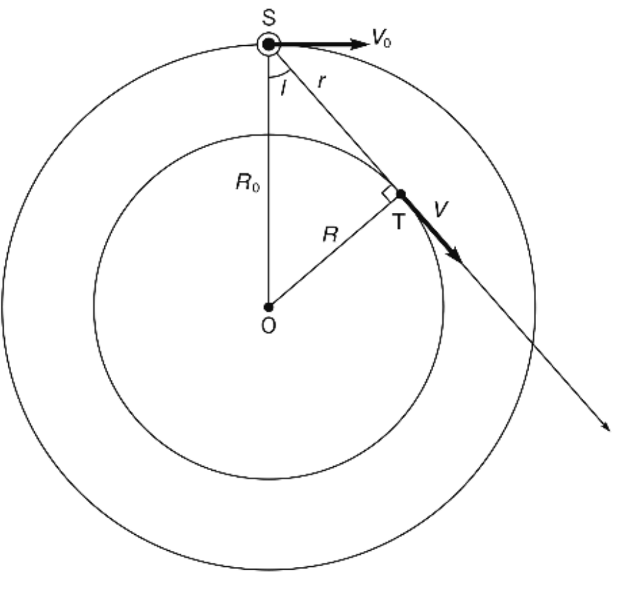

## 問38

## 問39

## 問40

