## 問1

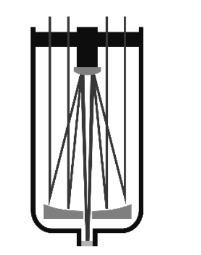

## 問2

## 問3

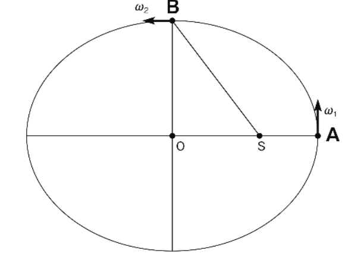

## 問4

## 問5

## 問6

## 問7

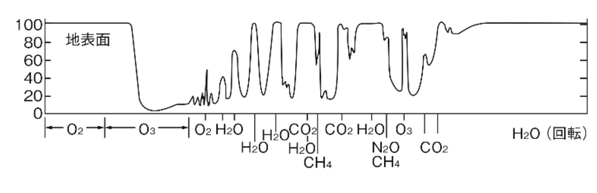

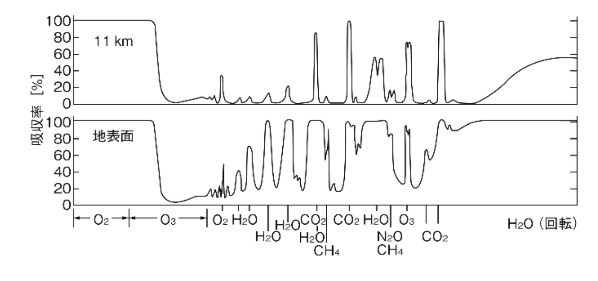

## 問8

## 問9

## 問10

## 問11

## 問12

## 問13

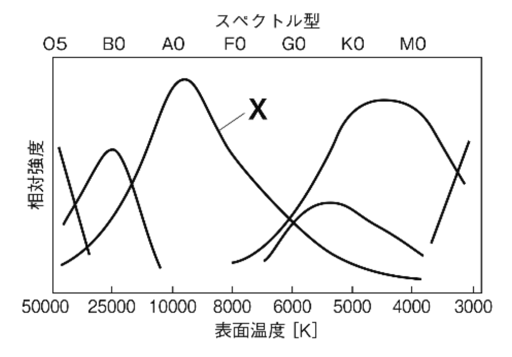

## 問14

## 問15

## 問16

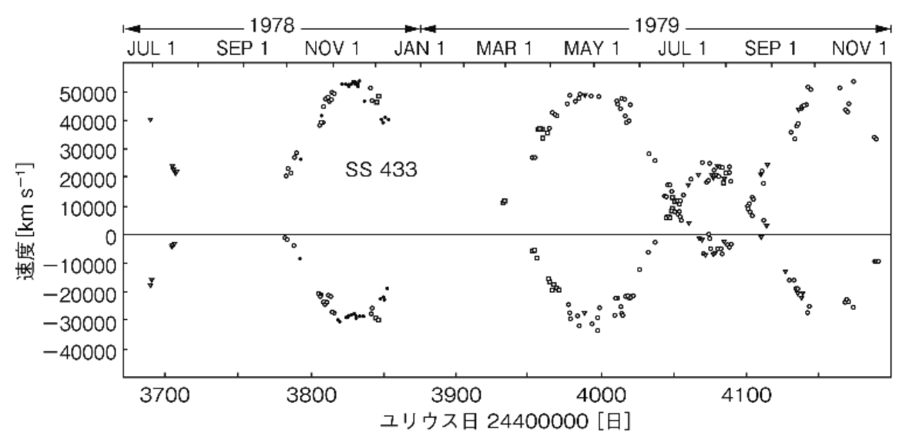

## 問17

## 問18

## 問19

## 問20

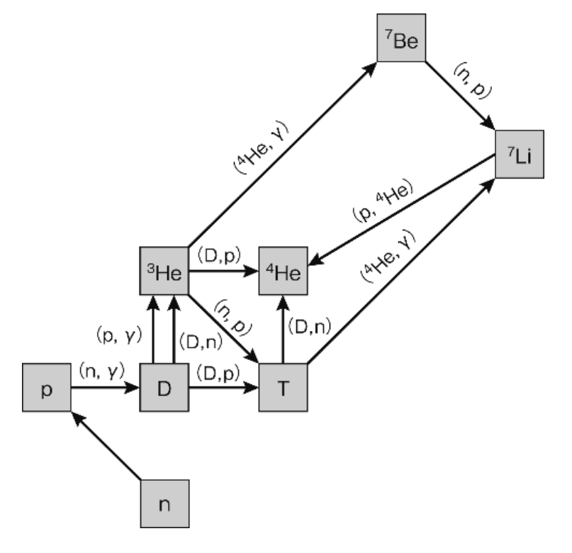

## 問21

## 問22

## 問23

## 問24

## 問25

## 問26

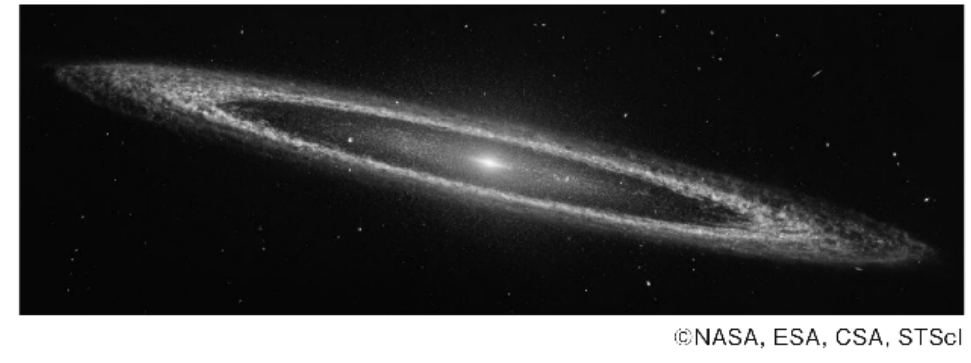

## 問27

## 問28

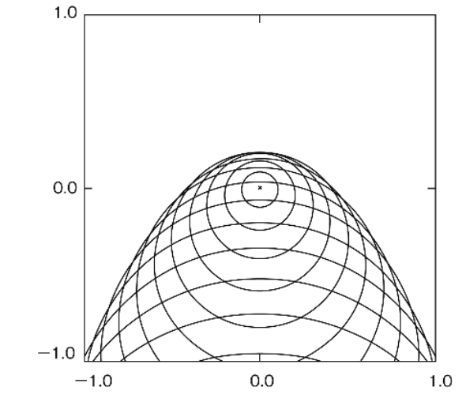

## 問29

## 問30

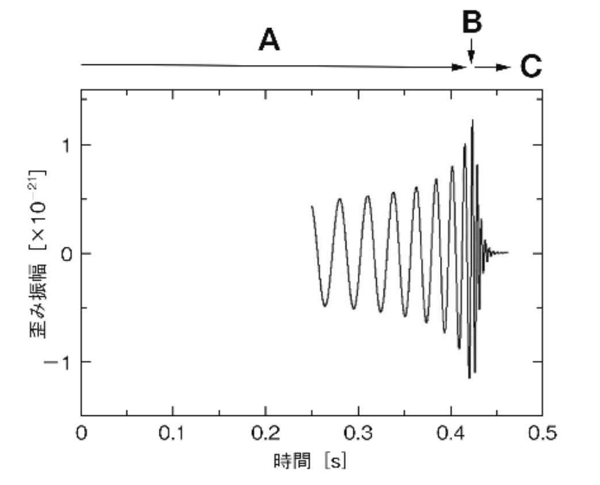

## 問31

## 問32

## 問33

## 問34

## 問35

## 問36

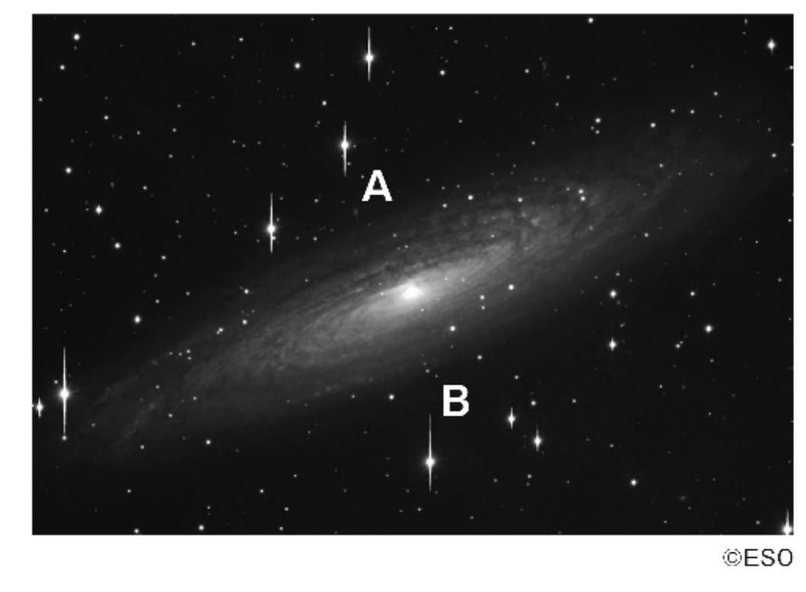

## 問37

## 問38

## 問39

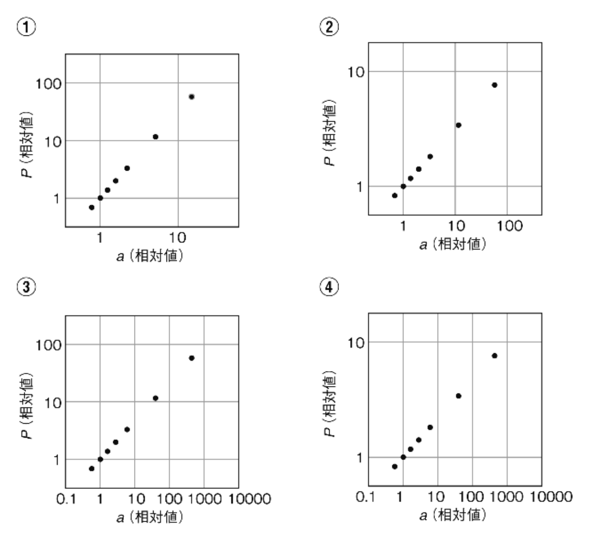

## 問40

