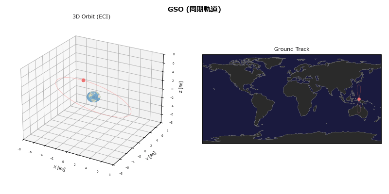
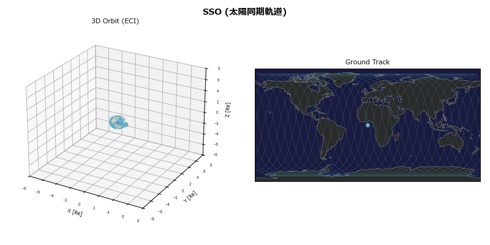
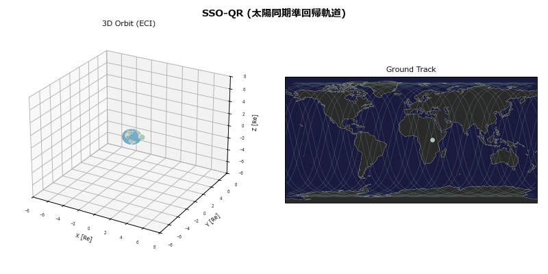
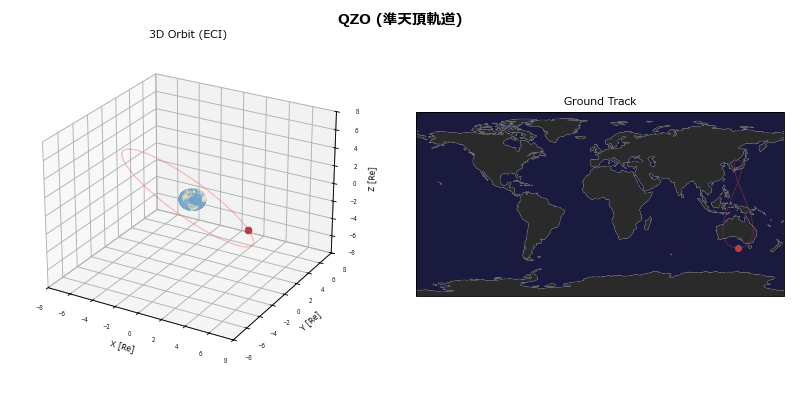
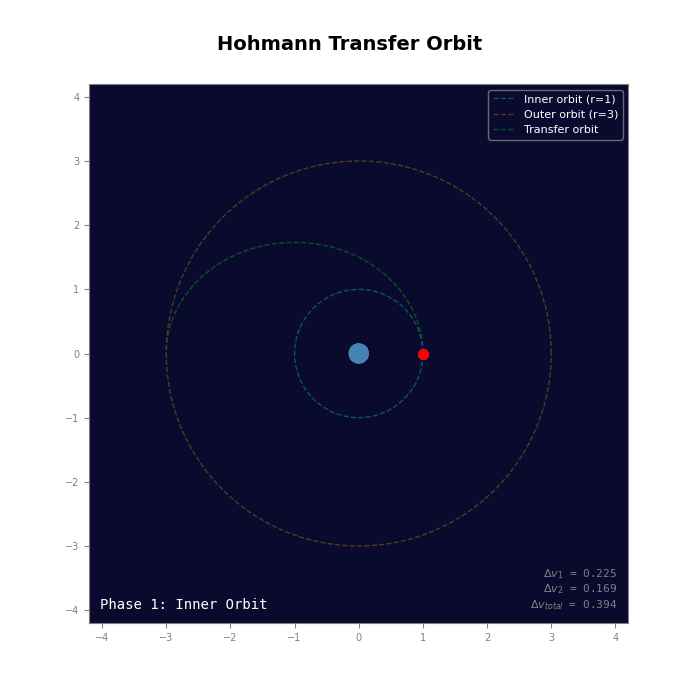

## 軌道

### 静止軌道
  
- 自転してる地球表面との相対関係が一定の軌道
- 地球から見ると人工衛星が静止しているように見える。
- 「衛星の軌道周期」=「地球の自転周期(24h56m4.09s)」
- 赤道上空35,786km
- (例)気象衛星「ひまわり」、通信衛星

### 同期軌道

- 「衛星の軌道周期」=「地球の自転周期(24h56m4.09s)」
- 円軌道、楕円軌道が存在
- 軌道傾斜角は0度じゃなくてもよし
- 高緯度の観測、通信に適する。

### 回帰軌道

### 太陽同期軌道

### 太陽同基準回帰軌道

### 準天頂軌道

### 上記すべての重ね合わせ

## 軌道力学

### ホーマン軌道

### 準ホーマン

todo

### 静止トランスファ軌道

todo